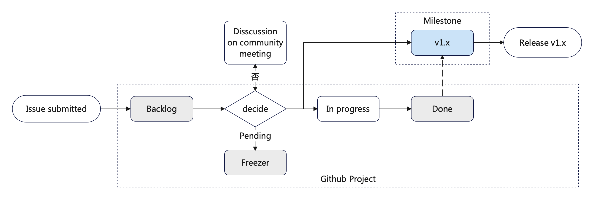

# Developing inspection

## Roadmap

- All demand should be recorded as issues, and issues will be managed by Github Project and Milestone.

  

## Proposal

- When should I submit a proposal before coding?
    - big changes, e.g., changes the project structure, add a new API/CRD
    - requires multiple parties/subprojects participating to complete
    - will be graduating from one stage to another (ex. alpha to beta, beta to GA)
    - needs significant effort or changes Koordinator in a significant way (ex. something that would take 10 person-weeks to implement, introduce or redesign a system component, or introduces API changes)
    - users will notice and come to rely on
- You can submit the code PR alone with the proposal PR, but it should not get merged before the later one.
- The approvers of proposal directory are the community maintainers, and maintainers should involve those approvers of the related areas of the proposal to review the PR.

## Code Pull Request

- Tests are automatically run for all Pull Requests, incuding unit tests, E2E tests and some other lint checkers
- Make sure the UT coverage should not be decreased, and the additional UT cases should be efficient
- E2E tests are required for new features, the case logic should be clear and each step should have description
- Except some essential bugfix or only docs/comments changed, code PRs had better open at least 1~3 days to make sure enough members notice and review them, which requires approvers not to merge the PR immediately
